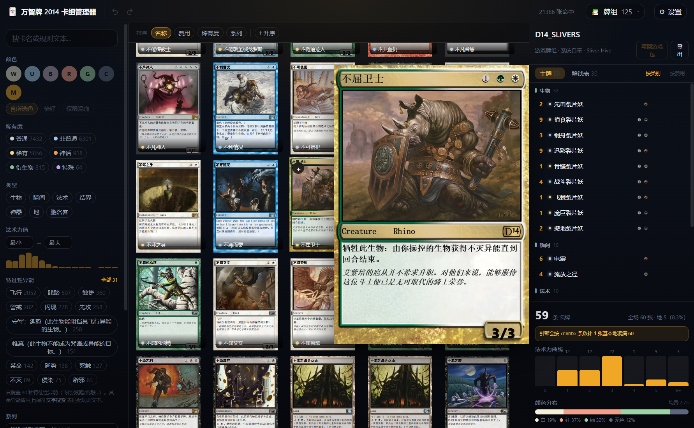

# 万智牌 2014 卡组管理器（dotp2014deckmanager）

> 给《Magic: The Gathering — Duels of the Planeswalkers 2014》用的**卡组管理器**：
> 按现有WAD文件读取牌池表，按关键词/颜色/稀有度筛选、悬浮放大看整张卡面、组卡存盘，
> 可以**直接读写游戏里的牌组**或把自制卡包**打包成 WAD 装进游戏**。
---

## 快速开始

### 方式一：下载现成的 exe（推荐）

去 [Releases](https://github.com/Emaginations/dotp2014deckmanager/releases) 下载
`dotp2014deckmanager.exe`，**放到Magic 2014游戏目录下**即可，免安装。

首次启动会**静默约 40 秒**（在扫你的游戏目录、建索引），之后启动就很快了。


### 方式二：从源码跑

```bash
pip install pywebview fastapi uvicorn pillow numpy pypinyin
cd frontend && npm install && npm run build && cd ..
python backend/main.py            # 开窗口
python backend/main.py --browser  # 只起服务，自己开浏览器（调前端方便）
```

打包成单文件 exe：

```bash
python build_exe.py               # 会先 npm run build 再 PyInstaller
```

### 环境要求

- Windows（pywebview 走系统自带的 **WebView2**，Win10/11 一般都有）
- 可选：社区卡包 [Community Wad](https://www.dropbox.com/sh/...)（卡池从 1 万张涨到 2 万多张）
---

## 项目状态

#### ✅ 写完了
#### ✅ 测完了
#### 🚧 正在维护（也许）

---

## 界面



支持拖拽删减、添加卡牌，
支持撤销 / 重做，


### 设置面板

| 区块 | 能做什么 |
|---|---|
| **游戏目录** | 直接改路径，或用「浏览…」弹原生目录框。改完提示重建索引 |
| **索引** | 看 5 份索引的状态，「刷新」（按指纹跳过没变的）或「强制重建」 |
| **WAD 文件** | 列出游戏目录里全部包（77 个 / 4 GB），一键**备份全部**到 `data/wad_backup/`，也能从备份**还原** |
| **检测并修复 .bsf** | **游戏随机崩溃时可以试试这个** —— 见下 |
| **诊断日志** | 最近的警告和错误，带堆栈 |

#### 检测并修复 `.bsf` —— 治那个「启动几秒后随机崩溃」

`.bsf` 是 UI 文字表。引擎的解析循环**只检查「条目起点」是否在缓冲区内，不检查数据本身**：

```asm
0x70a3d9  cmp ebx, [ebp-0x44]      ; 起点 < 尾 ?
0x70a3dc  jb  0x70a180
0x70a180  mov al, byte [ebx]       ; 逐字节扫 0x00
0x70a182  inc ebx
0x70a185  jne 0x70a3d9
; ---- 出循环，ebx 指向 NUL 之后 ----
0x70a18b  movzx ecx, word [ebx+1]  ; ★ 读 valLen —— 没有边界检查
0x70a18f  mov al, byte [ebx]       ; ★ 读 keyLen —— 同样没有
```

**起点在界内 ≠ 数据在界内。** 文件末尾多一个孤立的 `0x00`，循环就会再进一次、
把 `ebx` 推到缓冲区尾，这两条读指令落到**缓冲区外 3 字节**。读到的垃圾被当成
`valLen` 去拷 —— 内存可读时无害，**一旦缓冲区顶在已提交页边界上就是 ACCESS_VIOLATION**。

这解释了「**约 40% 概率、启动 4 秒后随机崩溃**」：堆布局随装了哪些包而变，
缓冲区落点也跟着变，所以改 WAD 会影响崩溃率。

`DATA_DECKS_D910.WAD`（中文包）的 9 个 `.bsf` 历史上就各多了一个尾部 `0x00`
（`DATA_CORE` 里的同名文件是干净的，说明是那个包制作时引入的）。

**设置 → 扫描** 会遍历所有 WAD 里的 `.bsf`（91 个），列出会越界读的；
**修复** 把多余的尾部字节删掉。和写回牌组一样走 `Wad.rebuild()`，写前自检、
自动备份、写后复验 `headerXml` 和目录数没变。

> 那 9 个字节在 `dotp2014decks` 里已经修过了，所以现在扫应该是「全部干净」。
> 这个功能留着是给**将来装了别的包又出问题**时用的。

检测逻辑有自测（`python wadtools.py --selftest`）：用构造出来的样本验证
「干净的不误报、多一个 `0x00` 能检出、`valLen` 写大能检出」——
不然「扫不到问题」到底是真干净还是检测失效，说不清。

### 卡组从哪来

「牌组」抽屉是**一个列表，按来源分组**：

| 分组 | 内容 | 能做什么 |
|---|---|---|
| **草稿** | `projects/*.json`，还没打包进游戏 | 编辑、保存、导出文本牌表 |
| **自制** | 自己打的包（`DATA_DLC_1M_*`） | 双击**直接编辑**，可删 |
| **系统自带** | 战役用的那批，**82 副** | 双击**直接编辑**（先弹提醒） |
| **社区包** | 别人做的包，**40 副** | 双击**直接编辑** |

每行右边是这副牌的**封面**（游戏里的牌盒贴图），左缘 30% 溶图渐变融进行背景。

贴图原图是 512×512 的 **3D 盒子渲染**（四周透明留白 + 左边一条盒脊），
后端裁两步：先取正面 `(203,92,162,256)`，再取上面 **40%** → **162×102**（比例 1.59）。
整块竖着铺只有 26px 宽太窄，截到 40% 有 66px，醒目得多。
比例在 `paths.RC_DECKBOX_FRONT` / `paths.DECKBOX_CROP_TOP` 调，
**前端用的是 ``，宽度跟着图片自身比例走**，改后端不用动前端。

### 新建 / 复制

顶部两个按钮：

- **新建** —— 左边填个名字，回车或点按钮，得到一份空工程
- **复制** —— 点一下进入**复制模式**，列表提示「在下面点一下要复制哪副牌组」，
  然后**单击**任意牌组就把它复制成新工程并直接打开

复制**不改原牌组**：游戏牌组走 `import` 落成独立工程，草稿走 `duplicate` 复制文件。
id 和名字都会自动加后缀防撞（`世界之树` → `世界之树-2` / `世界之树 副本`），
**连点多次不会互相覆盖**。

> [!NOTE] 为什么是单击不是双击
> 双击是「打开」。复制模式里改成单击，两个动作不会互相误触。

游戏牌组是**从 WAD 实时扫的**（走指纹缓存），不是本程序建的 —— 所以你装了什么包就有什么牌组。

### 两类保存，别搞混

| 按钮 | 写去哪 | 适用 |
|---|---|---|
| **保存草稿** | `projects/<id>.json` —— **游戏不认这个格式** | 草稿 |
| **构建** | 做成 WAD，**直接装进游戏目录** | 草稿 |
| **写回游戏包** | **直接改写游戏里的 WAD** | 双击打开的游戏牌组 |

### 构建：把卡组做成游戏能加载的包

「保存草稿」只是存工程文件，**游戏读不到**。要让游戏认，得点旁边的 **「构建」**：

```
① 选封面        从这副牌组里点一张卡 → 右边实时预览合成后的牌盒
② 选立绘        再点一张 → 预览四张贴图（头像 / 未解锁 / 背板 / 全身）
③ 打包          体检 → 打包并装入
```

**选卡范围是这副牌组自己的卡**（含解锁表），不是整个卡池 —— 两万多张里搜没有意义，
封面要的是这副牌的"招牌"，而招牌一定在牌表里。列表**按张数降序**排，
4 张的排在前面。一般也就 14~26 种，一眼扫完。

**两张图都走 Deck Builder 的原版合成管线**，不是自己画：

| 产物 | 素材 | 矩形 |
|---|---|---|
| 牌盒封面 512² | `D14_DeckBox{Mask,Overlay,Alpha}.png` | `(150,93,216,257)` |
| 圆形头像 256² | `D14_Personality{CircularMask,CircularAlpha}.png` | `(38,38,180,180)` |
| 大厅背板 256×512 | `D14_PersonalityBackplateAlpha.png` | `(0,0,256,512)` |
| 全身立绘 1024² | 无遮罩 | `(0,0,512,512)` |

四张立绘**全从你选的那一张插画派生**（未解锁头像是自动压暗去饱和）。
预览走 `/api/preview/*`，和打包时**逐像素一致**，不是示意图。

### 游戏里显示的名字

**必须是 ASCII，不能用中文。** 那一栏的字体**没有中文字形**，写「深海王座」

### 关于WAD包长什么样

```
<UID>/DATA_ALL_PLATFORMS/DECKS/<名>.XML              牌组定义（<CARD> + LandConfig 补地）
<UID>/DATA_ALL_PLATFORMS/DECKS/<名>_LAND_POOL.XML    可用基本地池
<UID>/DATA_ALL_PLATFORMS/UNLOCKS/<名>_UNLOCKS.XML    解锁表（恒 30 条）
<UID>/DATA_ALL_PLATFORMS/TEXT_PERMANENT/<名>_TEXT.XML 牌组名/描述（多语言表）
<UID>/DATA_ALL_PLATFORMS/AI_PERSONALITIES/<名>_PW.XML 鹏洛客人格（指向立绘）
<UID>/DATA_ALL_PLATFORMS/ART_ASSETS/TEXTURES/DECKS/<名>_BOX.TDX
<UID>/DATA_ALL_PLATFORMS/ART_ASSETS/TEXTURES/PLANESWALKERS/<名>_PW{,_locked,_Backplate,_full}.tdx
<UID>/HEADER.XML                                      容器头
```
---

## 关键设计

### 1. 卡面用 **DOM 分层合成**，不是位图

参考实现（C# 的 DotP 2014 Deck Builder）是用 GDI+ 把牌名和规则文本**画进位图**，
输出一张 356×512 的 `Bitmap`。**我们没有这么做**：

```
第 1 层   插画        铺满整张
第 2 层   卡框        中心镂空，插画从下面透出来
第 3 层  HTML 文本         牌名 / 类型行 / 规则文本 / 力防
第 4 层   符号        费用串、系列稀有度符号
```

**为什么值得**：文字保持矢量 → 悬浮放大后**依然锐利**（位图放大会糊）、能选中复制、
换中文字体不用重做素材，而且**不必为 2.2 万张卡各生成一张合成图**
（只要 162 张卡框）。

卡框镂空是**实测过**的：`DATA_CORE.WAD` 的 `W.TDX` 头写 512×356（横放），
转 90° 成竖版后，插画窗口 `(16,47,324,238)` 区域 alpha **全是 0**。

排版坐标来自 `CardInfo.cs:79-107` 的 Rectangle 常量表，全部换成百分比，任意尺寸等比缩放。

> 外部调用者（脚本 / agent）不想要浏览器时，用 `render.py` —— 同一套坐标，
> 用 PIL 渲染成 PNG。见 [`API.md`](API.md)。

### 2. **不做虚拟滚动**

从参考项目 phase 学到的：它 2 万多张卡一点不卡，靠的不是虚拟列表，而是
**搜索结果限流**（默认 175 条一页）+ `loading="lazy"`。
DOM 里同时存在的卡片节点永远只有一页。

需要更多就滚到底自动加载下一页。比虚拟滚动简单得多，而且已被验证有效。

### 3. 低内存读 WAD

`dotp2014decks` 的 `Wad.__init__` 是 `self.raw = f.read()` —— **整个文件读进内存**，
`deck_note.Art()` 因此常驻 **4.03 GB**；`cover.load_art()` 更是每取一张图就重开一个 100MB 的包。

本项目用 `wadlite.MMapWad`（`self.raw` 换成 `mmap`，`_parse()` 全程只读所以直接继承）
+ `WadPool` 句柄 LRU。打开 172MB 的包不再吃掉 172MB 常驻。

**自检**：`python backend/wadlite.py` 会拿 77 个包逐一比对 mmap 版和原版的解析结果 —— 全一致。

### 4. 缩略图磁盘缓存

解码一张 512×376 约 8ms，2.2 万张 ≈ 3 分钟纯 CPU。所以按需生成、落盘、二次访问直接读文件。

- 256px WebP，一张约 **4~10KB** → 全量约 180MB
- 分片存放（`thumbs/<两位哈希>/`），不把 2 万多个文件堆一个目录
- 先写临时文件再改名 —— 半截文件被读到会让浏览器缓存坏图

### 5. 直接改写 WAD —— 四条保险

把改动写回游戏包是**不可逆的覆盖**，所以下了四道闸（`deckwrite.py`）：

1. **必须走 `Wad.rebuild()`，不能重新打包。**
   `dotp2014decks` 在这上面踩过大坑：用「按路径重新搭树、从头打包」的写法，
   会丢掉 WAD 头部的 `headerXml`（内容包声明）和空目录 ——
   后果是**游戏启动后变英文、中文全渲染成 `•`**（文本加载了，中文字体没加载）。
   `rebuild()` 把头部 + dataOffsets 数组 + 文件表**逐字节原样复制**，只重写变动的条目。

2. **写前自检**：先跑一次 `rebuild({})`，必须能字节级还原原文件。
   还原不了说明这个包的布局有 rebuild 处理不了的东西 → 中止，原文件不动。

3. **整包备份**：写到 `data/backups/<包名>.<时间戳>.bak`，出了事直接拷回去。

4. **只做外科手术**：只替换 `<CARD>` 列表和 `<LandConfig>`，
   `<DECK>` 上的全部属性（uid / content_pack / personality / steam_id…）
   和 `<DECKSTATISTICS>` 原样保留 —— 重新生成容易漏字段。

另外会检查**数据块是否被多个条目共用**，共用就不能单独改（会波及别的条目）。

---

## 目录结构

```
dotp2014deckmanager/
├── backend/
│   ├── main.py          pywebview 入口（起 uvicorn 线程 + 开窗口）
│   ├── api.py           FastAPI 路由 + 静态托管
│   ├── cardset.py       卡牌查询层（筛选 / 排序 / 分页 / 元数据）
│   ├── artcache.py      取插画 + WAD 句柄 LRU + 缩略图缓存
│   ├── render.py        卡面渲染成 PNG（给外部/agent 用）
│   ├── deck.py          卡组模型 / 文本牌表 / 校验 / 统计
│   ├── wadlite.py       mmap 版 WAD 读取 + 句柄池
│   ├── tex.py           TDX 解码
│   ├── settings.py      配置 + WAD 指纹
│   ├── log.py           日志 / 错误处理
│   ├── cli.py           命令行入口
│   ├── paths.py         全局路径与排版常量
│   ├── artgen.py        ★ 牌盒封面 / 鹏洛客立绘合成（走 Deck Builder 那套素材）
│   ├── packer.py        ★ 打包成 WAD：XML 生成 + uid 分配 + 装入游戏目录
│   ├── fsx.py           原子写 + Windows 重试（见「踩过的坑」）
│   ├── assets/          ★ 渲染素材（随程序发布）：deckbox/ + personality/
│   ├── vendor/          从 dotp2014decks 拷来的 wadtool / dxt / wadbuild
│   └── tools/
│       ├── rebuild.py       统一入口：按指纹决定建不建
│       ├── build_pool.py    卡池（卡名/费用/颜色/类别/稀有度）
│       ├── build_details.py 详情（关键词/规则文本/系列/赛制）
│       ├── build_artidx.py  插画索引（卡 -> ARTID -> 图在哪）
│       ├── build_deckbox.py 牌盒封面名 -> 贴图位置
│       └── export_frames.py 卡框/PT框/符号 -> PNG
├── frontend/            Vite + React 19 + TS + Tailwind v4 + Framer Motion
│   └── src/components/
│       ├── CardFace.tsx     ★ DOM 分层合成卡面（网格/悬浮/牌组三处共用）
│       ├── HoverZoom.tsx    ★ 悬浮放大浮层
│       ├── CardGrid.tsx     平铺网格 + 滚到底加载
│       ├── FilterPanel.tsx  筛选面板
│       ├── DeckPanel.tsx    牌表 + 统计 + 曲线
│       ├── PackWizard.tsx   ★ 打包向导（选封面 / 定立绘 / 装入）
│       └── bits.tsx         小部件
├── data/                索引与缓存（不进版本库）
├── projects/            卡组工程（一个卡组一个 .json）
└── out/                 打包产物（也会直接装进游戏目录）
```

---

## 对外 API

可以使用agent或其他程序调用牌组编辑、生成、构建为wad。
见 [`API.md`](API.md)。三种调用方式能力一样：

```bash
# HTTP（在线文档 /api/docs）
python backend/main.py          # 起服务

# 命令行
python backend/cli.py search "dragon" --color R --cmc-max 4
python backend/cli.py deck add <id> "Oath of Druids" 4
python backend/cli.py render "Shivan Dragon" -o out.png --width 744

# Python
import cardset, render
render.render_card(cardset.get().key_of("Sol Ring"), 744).save("ring.png")
```
---

## 相关

- 参考项目：[phase](https://phase-rs.dev) —— React + 现代卡牌 UI 的做法
- 卡池数据来自你本机安装的《Magic 2014》与可选的 Community Wad，
  **本仓库不附带任何游戏素材**

---

## 免责声明

- 本项目是**非官方**的第三方工具，与 Wizards of the Coast / Hasbro 无关，
  未获其授权或认可。Magic: The Gathering、Duels of the Planeswalkers
  及相关名称、美术资产均为其各自所有者的商标或版权财产。
- **本仓库不含卡图、卡框、牌盒贴图、音频等游戏素材**。程序运行时从
  **你自己安装的游戏目录**里读取这些素材，只在本地使用。`.gitignore` 把
  `data/`（索引、缩略图缓存、WAD 备份）和 `out/`（打包产物）全部排除在版本库外。
- 请只在合法拥有的游戏副本上使用。

## 协议

[Apache-2.0](LICENSE)（末尾附有附加条款）

---

> 若您让 AI 使用了本项目，请创建并将与 AI 对话的过程开源并写入 NOREADME.md 文件中（仅限用户发言，省略 AI 回复），直到基本功能已经实现。同时，您必须将本附加条款添加到您正在使用的协议最后方。
